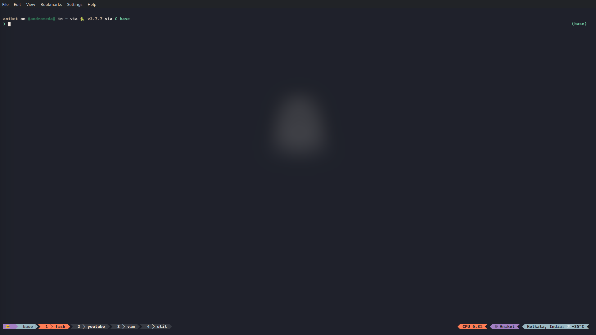

# Nisha colorscheme for Tmux

## Installation

### With TPM

You can install this plugin with [TPM](https://github.com/tmux-plugins/tpm)

1. Set up TPM as stated in their docs.

2. Add this line to the bottom of your Tmux config - 
```
   set -g @plugin 'heraldofsolace/nisha-tmux'
```

3. Reload Tmux configuration - `tmux source ~/.tmux.conf`

4. Install the plugin `prefix + Ctrl-I`

### Screenshots

#### Full Screen



#### Status Bar


#### Left status bar (normal)


#### Left status bar (prefix pressed)

[prefix](screenshots/status-prefix.png)

### Configuration

Coming soon!

### Light Variant

Coming soon!
